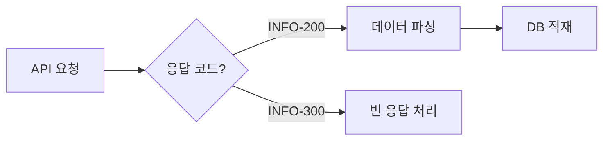

# 기술 블로그(Tech Blog) 스타일 가이드

> 이 문서는 `tech/` 디렉토리에 작성되는 기술 포스팅을 위한 가이드라인입니다.
> 운영 블로그(`story/`)가 '과정의 서사'에 집중한다면, 기술 블로그는 '구현과 해결'에 집중합니다.
> 단, **비개발자가 AI와 함께 성장하며 기록하는 기술 블로그**라는 정체성을 유지합니다.

## 1. 이 글은 누구를 위한 것인가

- **공공데이터 API를 실제로 써야 하는 개발자**: 식약처 API 연동, 공공데이터 ETL 등의 실전 레퍼런스
- **AI와 함께 개발하는 사람**: 프롬프트 설계, 검증 체계, AI 실패 사례와 대응 방법
- **주니어 개발자, 혹은 AI를 활용해 개발하려는 비개발자**: 파싱, 매칭, 데이터 정합성 등 범용적인 문제의 실전 해결 사례

## 2. 시리즈별 성격

### `tech/public-data/` — 공공데이터 실전 레시피
- **성격**: 레퍼런스. 검색해서 찾아온 사람이 바로 써먹을 수 있는 글.
- **초점**: 데이터의 구조, 예외 케이스, 정합성 검증 로직
- **톤**: 명확하고 건조하게. 불필요한 감정 묘사 없이 팩트와 코드 중심.
- 데이터 명세, 실제 데이터 예시(Raw vs Parsed), 발견된 오류 사례 위주로 작성합니다.
- **예시 제목**: "식약처 API 11종 연동기: 응답 구조가 4개나 되는 이유"

### `tech/ai-dev/` — AI 협업 개발기
- **성격**: 과정 기록. AI와 어떻게 일했고, 어디서 실패했고, 어떻게 고쳤는지.
- **초점**: 프롬프트 엔지니어링, AI의 오답과 교정 과정
- **톤**: 건조하되 정직하게. 프롬프트와 AI 응답을 있는 그대로 보여주고 분석.
- **사용 프롬프트**: 문제를 해결하기 위해 AI에게 던진 핵심 질문.
- **AI의 실수**: AI가 잘못 짠 코드나 환각(Hallucination) 사례.
- **교정 과정**: 어떻게 질문을 바꿔서 올바른 답을 얻어냈는지.
- **예시 제목**: "AI가 만든 매칭 엔진, 2,434건이 전부 틀렸다"

## 3. 톤앤매너

### 운영 블로그와의 차이

| | 운영 블로그 (`story/`) | 기술 블로그 (`tech/`) |
|---|---|---|
| 종결어미 | "-습니다/-에요" 혼용 | "-습니다" 기본, 간결체 허용 |
| 감정 표현 | 솔직한 감정, 괄호 부연 | 최소화. 단, "몰랐다/틀렸다"는 남김 |
| 독자 호칭 | 암묵적 "여러분" | 없음. 정보 전달에 집중 |
| 숫자 | 겸손한 프레임으로 감쌈 | 있는 그대로 제시 |
| 전문 용어 | 비유와 예시로 풀어줌 | 한글/영문 병기 후 그대로 사용 |

### 핵심 원칙

- **건조하되 정직하게(Dry but Honest)**: 감정적 수식어는 배제하되, 필자의 인지적 한계나 착오는 솔직하게 기록합니다.
- **명확함(Clear)**: 모호한 표현을 피하고 기술 용어를 정확하게 사용합니다.
- **구조적(Structured)**: 배경→문제→시도→해결→결과 흐름을 따릅니다.

### 피해야 할 것

- ❌ 감정 위주 서술: "정말 힘들었다", "드디어 해냈다"
- ❌ 과잉 겸손: "아직 많이 부족하지만", "전문가가 보시기엔 웃기겠지만"
- ❌ 운영 블로그 톤의 혼입: "어쩌다 보니", "신기하게도"
- ❌ 근거 없는 단정: "이게 최선의 방법이다"

### 권장하는 것

- ✅ 수치로 말하기: "매칭율 99.3%", "처리 시간 3시간→40분"
- ✅ 대안 비교: "A안은 ~하고, B안은 ~한데, B를 선택한 이유는 ~"
- ✅ 한계를 명시: "이 방법의 단점은 ~이고, 개선한다면 ~"
- ✅ 배운 것을 한 문장으로: "공공 API에서 '성공' 응답이 실제 성공을 의미하지 않을 수 있다."
- ✅ "몰랐던 점" 기록: 이 문제를 해결하며 새로 알게 된 개념(CS 지식 등)

## 4. 글의 구조 (템플릿)

기술 포스팅은 기본적으로 **Problem-Solution** 구조를 따릅니다.

### 제목
- 기술적 키워드 + 구체적 맥락이 포함되어야 합니다.
- ✅ "식약처 API 11종 연동기: 응답 구조가 4개나 되는 이유"
- ✅ "104만 건 ETL에서 증분 동기화가 안 될 때의 전략"
- ❌ "API 연동 후기" (너무 추상적)
- ❌ "API 연결하느라 정말 고생했습니다" (운영 블로그 톤)

### 도입부 (Context)
- 2~3문장으로 배경을 설명합니다.
- 이 글을 읽으면 무엇을 알 수 있는지 명시합니다.
- 운영 블로그에 해당 배경 이야기가 있다면 링크를 겁니다.

### 문제 정의 (Problem)
- 직면한 기술적 문제를 구체적으로 서술합니다.
- 에러 메시지, 잘못된 데이터 예시, 성능 수치 등 증거를 포함합니다.
- (ai-dev) AI가 처음에 내놓은 잘못된 해결책이나 접근 방식.

### 시도와 의사결정 (Alternatives & Decision)
- 고려한 방법들을 나열하고, 선택의 논리적 근거를 제시합니다.
- (ai-dev) 결정적인 프롬프트 문구와 그 의도.

### 구현 (Implementation)
- 핵심 코드만 발췌합니다. 전체 코드 붙여넣기 금지.
- 필요하면 다이어그램으로 흐름을 보여줍니다.

### 결과 및 교훈 (Result & Lessons)
- 수치로 결과를 보여줍니다.
- 한계점과 개선 과제를 명시합니다.
- **한 줄 교훈**으로 마무리합니다.

## 5. 작성 규칙

### 공개 수위
- **개념과 접근 방식**을 공유합니다. 구현 디테일을 그대로 복사할 수 있을 정도로 노출하지 않습니다.
- 코드는 **의사코드(pseudocode) 수준**이거나, 핵심 아이디어를 보여주는 짧은 발췌로 제한합니다.
- 클래스명, 메서드명, 파일 경로 등 내부 구조는 **필요한 만큼만** 언급합니다. 전체 아키텍처를 노출하지 않습니다.
- API 응답 예시 등 **공공 데이터의 구조**는 공개해도 무방합니다 (이미 공개된 정보).
- 비개발자도 "어떤 문제가 있었고, 어떤 방향으로 풀었는지"를 이해할 수 있어야 합니다.

### 분량
- 본문 2,000~4,000자 (코드 블록 제외).
- 코드 블록은 한 글에 2~3개 이내. 각 블록은 10줄 이하.
- 코드보다 **다이어그램, 표, 비유**를 우선 사용합니다.
- 너무 길면 시리즈로 분할합니다.

### 코드 블록
- 실제 코드가 아닌 **개념을 전달하는 수준**으로 단순화합니다.
- 반드시 언어를 명시합니다. (`python`, `json` 등)
- 가로 스크롤이 생기지 않도록 80자 내외로 개행합니다.

```json
// 식품안전나라 응답 (실제 공공 API 응답 구조)
{
  "I1250": {
    "RESULT": { "CODE": "INFO-000" },
    "total_count": "1043709",
    "row": [{ "PRDLST_REPORT_NO": "..." }]
  }
}
```

### 용어
- 처음 등장하는 전문 용어는 한글/영문 병기합니다.
  - 예: 파싱(Parsing), ETL(Extract, Transform, Load)
- 글 전체에서 동일 대상은 동일 단어로 지칭합니다.
  - '상품', '제품', '아이템' 혼용 금지 → '제품'으로 통일

### 시각 자료
- 데이터 흐름이나 아키텍처는 Mermaid 다이어그램으로 표현합니다.
- 비교 데이터는 표(table)로 정리합니다.



## 6. 운영 블로그와의 교차 참조

같은 사건(새우깡, 괄호 파싱 등)을 두 블로그에서 다룰 수 있습니다.

### 규칙
- **기술 블로그 → 운영 블로그**: 도입부에서 간단히 링크합니다.
  - 예: > *이 글의 배경이 되는 이야기는 [9화: 괄호 안의 괄호 안의 괄호](../../story/09_bracket.md)에서 읽을 수 있습니다.*
- **운영 블로그 → 기술 블로그**: 글 말미에 "기술적 디테일" 링크를 답니다.
  - 예: > *파싱 엔진의 구현 과정이 궁금하다면 → [괄호 깊이 3단계 파싱기 만들기](../../tech/public-data/03_bracket-parser.md)*
- 내용을 중복하지 않습니다. 한쪽에서 다룬 것은 다른 쪽에서 링크로 대체합니다.

## 7. 체크리스트

글을 마무리하기 전에 확인합니다.

- [ ] 제목에 기술 키워드와 구체적 맥락이 있는가?
- [ ] 도입부에서 "이 글을 읽으면 알 수 있는 것"이 명확한가?
- [ ] 문제→해결 흐름이 논리적으로 연결되는가?
- [ ] 코드는 핵심만 발췌했는가? (전체 붙여넣기 아닌지)
- [ ] 수치/증거가 포함되어 있는가?
- [ ] 한계점을 명시했는가?
- [ ] 민감 정보(API Key, 개인정보)가 없는가?
- [ ] 운영 블로그와 교차 참조가 필요한 경우 링크를 달았는가?
- [ ] 맞춤법과 띄어쓰기는 정확한가?

---

> **이 가이드는 `tech/` 디렉토리의 글에만 적용됩니다.**
> `story/` 디렉토리의 글은 STORY_STYLE_GUIDE.md를 따르세요.
